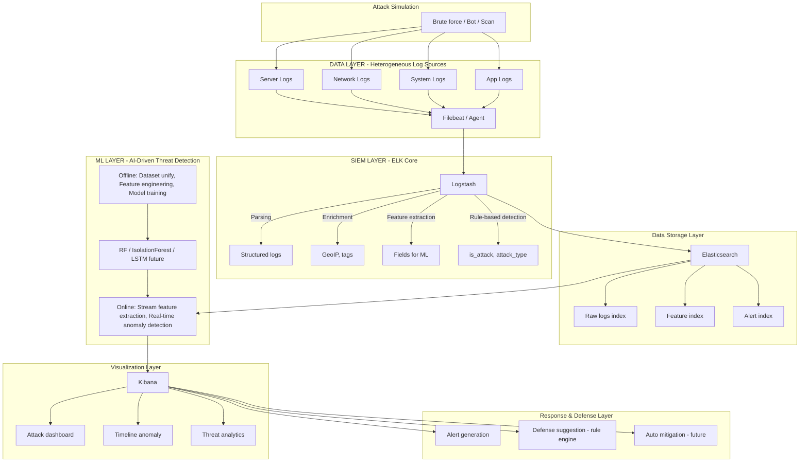

# Kiến trúc ELKShield theo Research Paper

Tài liệu này ánh xạ kiến trúc đề xuất (sơ đồ High-level + ML/Visualization/Response) và năm tầng research sang implementation hiện tại của dự án.

---

## Sơ đồ tổng quan (High-level Architecture)

Luồng dữ liệu: **Attack Simulation** → **Log Collection** → **Log Processing (SIEM Core)** → **Data Storage** → **ML Layer** → **Visualization** → **Response & Defense**.

---

## 1. Data Layer (Nguồn dữ liệu) — *Heterogeneous Log Sources*

| Nguồn trong paper | Implementation trong ELKShield | File / Config |
|-------------------|---------------------------------|----------------|
| **SSH logs** | Log SSH (auth, sshd) từ server | Filebeat đọc file log → `config/filebeat/filebeat.yml`; test.log (Documents); `data/russellmitchell/gather/.../auth.log` |
| **System logs** | Log hệ thống (syslog-style) | Cùng pipeline Logstash; hỗ trợ `SYSLOGTIMESTAMP`, host, process |
| **Network logs** | Log mạng / proxy | Có thể thêm input Filebeat trỏ tới log network; hiện tại tập trung SSH + web |
| **App logs** | Log ứng dụng (web server) | Apache/HTTP log qua Filebeat `log_type: web`; `data/apache-http-logs-master/` |
| **Synthetic attack logs** | Log tấn công mô phỏng | `scripts/generate_synthetic_logs.py` → `data/raw/logs.csv`; Ghi log (test.log) trong app |
| **Public datasets** | Dataset công khai | Russell Mitchell (`data/russellmitchell/`), Kaggle SSH (`data/ssh_anomaly_dataset.csv`), Twente (dataset1) |

**Thu thập:** Filebeat / Agent → gửi tới Logstash (port 5044). Nhiều nguồn khác nhau → **heterogeneous log sources**.

---

## 2. SIEM Layer (ELK Core) — *Hybrid SIEM Architecture*

ELK đảm nhiệm: **Log ingestion** | **Log parsing** | **Correlation** | **Storage** | **Visualization**.

| Chức năng | Công cụ | Chi tiết implementation |
|-----------|---------|---------------------------|
| **Log ingestion** | Filebeat | `config/filebeat/filebeat.yml` đọc file (paths), gửi Beats tới Logstash |
| **Log parsing** | Logstash | `config/logstash/pipeline.conf`: Grok parse SSH (timestamp, host, pid, status, user, source_ip), HTTP (clientip, verb, request, response) |
| **Enrichment** | Logstash | Trường `@timestamp` (date filter), `index_prefix` theo log_type; có thể bổ sung GeoIP (enrichment) |
| **Feature extraction** | Logstash + Python | Logstash: trích field (source_ip, status, request); Python: `data_preprocessing.py` — failed_login_count, time window, ip_hash, v.v. |
| **Rule-based detection** | Logstash | **Brute force:** `Failed password` hoặc `invalid user` → `is_attack: true`, `attack_type: brute_force`, `severity: high`. **SQL injection:** regex trên `request`. **XSS:** regex trên `request`. |
| **Correlation** | Python | Cửa sổ thời gian (time window), đếm theo IP trong `data_preprocessing.py` |
| **Storage** | Elasticsearch | Index theo loại: `ssh-logs-*`, `web-logs-*`, `test-logs-*` (raw); `ml-alerts-*` (alert từ ML) |
| **Visualization** | Kibana | Discover, Dashboard, Timeline; index pattern `ml-alerts-*`, `test-logs-*`, `ssh-logs-*` |

Đây là **SIEM truyền thống** (rule-based + lưu trữ + hiển thị); ELKShield mở rộng thêm tầng ML phía dưới.

---

## 3. ML Layer (AI Enhancement) — *AI-Driven Threat Detection Engine*

Điểm khác biệt so với ELK thuần: **SIEM + ML anomaly detection**.

### Offline pipeline

| Thành phần paper | Implementation |
|------------------|----------------|
| **Dataset aggregation** | `scripts/merge_training_datasets.py`: gộp Synthetic + Russell Mitchell + Kaggle (+ Custom) → `data/training/unified_ssh_dataset.csv` |
| **Feature engineering** | `scripts/data_preprocessing.py`: trích đặc trưng SSH (failed_login_count, failed_login_count_window, hour, day_of_week, ip_hash, attack_type_frequency, ...); web (status, 4xx/5xx, error rate) |
| **Model training** | `scripts/train_model.py` → `scripts/ml_detector.py`: **Random Forest** (chính), **Isolation Forest**, **One-Class SVM**; lưu `data/models/ssh_attack_model.joblib`. **LSTM:** future work |

### Online pipeline

| Thành phần paper | Implementation |
|------------------|----------------|
| **Stream feature extraction** | `run_pipeline_detection.py`: extract log từ ES (hoặc test.log) → preprocess (cùng feature engineering) → CSV processed |
| **Real-time anomaly detection** | `ml_detector.py` load model → predict trên batch → ghi kết quả |
| **Behavioral analysis** | Đặc trưng theo thời gian (time window, tần suất theo IP) phản ánh hành vi; model RF/IF học pattern bất thường |

Near real-time: chạy detection theo chu kỳ (cron/Task Scheduler), xem `docs/NEAR_REALTIME_DETECTION.md`.

---

## 4. Detection Strategy — *Hybrid Detection Strategy*

| Loại | Ví dụ / Implementation |
|------|-------------------------|
| **Rule-based detection** | **Logstash:** brute force (Failed password, invalid user), SQL injection (regex request), XSS (regex request). **Python:** có thể mở rộng rule theo threshold (login frequency, IP reputation) trong preprocess hoặc script riêng. |
| **ML detection** | **Random Forest** (supervised, chính), **Isolation Forest** (unsupervised), **One-Class SVM** (unsupervised). **Deep Learning (LSTM):** future work. |

Kết quả rule-based: field `is_attack`, `attack_type` ngay trên log trong ES. Kết quả ML: index `ml-alerts-*` (ml_anomaly, ml_model, defense_recommendations).

---

## 5. Response Layer — *Semi-Automated Response Framework*

| Chức năng | Hiện trạng | Ghi chú |
|-----------|------------|--------|
| **Alert** | Có | Index `ml-alerts-*`; Kibana Alerting (rule theo tài liệu); app desktop "View Alerts" |
| **Visualization** | Có | Kibana: Attack dashboard, Timeline anomaly, Threat analytics; app: Attacks Timeline (24h), thống kê |
| **Suggest defense** | Có | `scripts/defense_recommendations.py`: theo `attack_type` (brute_force, sql_injection, xss, ...) → đề xuất phòng thủ; ghi vào `defense_recommendations` trong ml-alerts; app "Xem đề xuất phòng thủ" (rule engine phía backend) |
| **Auto block IP** | Future | Chưa triển khai; hướng: webhook/script gọi firewall hoặc API block |
| **Firewall integration** | Future | Tích hợp rule firewall (iptables, nftables, cloud firewall) |
| **IDS integration** | Future | Tích hợp cảnh báo với IDS hoặc SOAR |

---

## Ánh xạ Index Elasticsearch

| Index pattern | Nội dung | Tầng |
|---------------|----------|------|
| `test-logs-*` | Log raw từ Filebeat (demo / test) | Data Storage (raw logs) |
| `ssh-logs-*` | Log SSH đã parse + rule-based (is_attack, attack_type) | Data Storage + Rule-based |
| `web-logs-*` | Log web đã parse + rule-based | Data Storage + Rule-based |
| `ml-alerts-*` | Cảnh báo ML (ml_anomaly, source_ip, defense_recommendations, ml_model) | Alert index, Response |

Feature index: đặc trưng ML hiện được tính trong Python và dùng trực tiếp cho train/predict; có thể bổ sung index lưu feature (vd. `features-*`) cho analytics sau này (future).

---

## Luồng end-to-end (theo sơ đồ)

1. **Attack simulation** (Brute force / Bot / Scan) → tạo log (test.log hoặc synthetic).
2. **Log Collection:** Server/System/App log → Filebeat.
3. **Log Processing (SIEM Core):** Logstash — parsing, enrichment, feature extraction, **rule-based detection** → Elasticsearch (raw + alert từ rule).
4. **Data Storage:** Raw logs index (test-logs, ssh-logs, web-logs); Alert index (ml-alerts từ ML).
5. **ML Layer:** Offline train (unify → feature → RF/IF) → Online: extract feature từ stream → real-time anomaly detection → ghi ml-alerts.
6. **Visualization:** Kibana — attack dashboard, timeline anomaly, threat analytics.
7. **Response & Defense:** Alert generation, Defense suggestion (rule engine), Auto mitigation (future).

---

## Chạy luồng theo kiến trúc

- **Một lệnh:** `python scripts/run_by_architecture.py` — chạy tuần tự: Data Layer (tạo/synthetic) → kiểm tra SIEM → ML Train (nếu chưa có model) → tạo test.log → Detection → mở Kibana (Response).
- **Trong app:** Chọn **Chạy luồng theo kiến trúc (1→5)** (System Setup) → Execute. Output hiển thị trong Terminal Output; sau khi xong mở Kibana ml-alerts và có thể chọn "Xem đề xuất phòng thủ" (mục 13).
- **Cấu hình ánh xạ tầng:** `config/architecture_layers.yaml` — mapping 5 tầng sang script/config.
- **Response Layer (future):** `scripts/response/README.md`, `scripts/response/auto_mitigation_stub.py` — placeholder cho auto block IP, firewall/IDS.

## Checklist từng task

- **[CHECKLIST_CAU_TRUC_5_TANG.md](CHECKLIST_CAU_TRUC_5_TANG.md)** — Checkmark từng task theo 5 tầng (Data, SIEM, ML, Detection, Response + luồng + index). Đã hoàn thành / Future được đánh dấu rõ.

## Tài liệu liên quan

- [TASK_HOAN_THANH_SIEM_ML.md](TASK_HOAN_THANH_SIEM_ML.md) — Checklist kiến trúc SIEM + ML hybrid.
- [DANH_GIA_VA_DE_XUAT_CAI_TIEN.md](DANH_GIA_VA_DE_XUAT_CAI_TIEN.md) — Chức năng hiện có và đề xuất cải thiện.
- [HUONG_DAN_DASHBOARD_KIBANA.md](HUONG_DAN_DASHBOARD_KIBANA.md), [HUONG_DAN_ALERTING_KIBANA.md](HUONG_DAN_ALERTING_KIBANA.md) — Visualization và Alerting.
